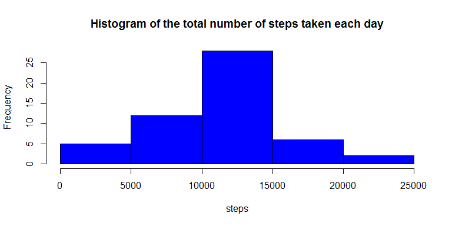
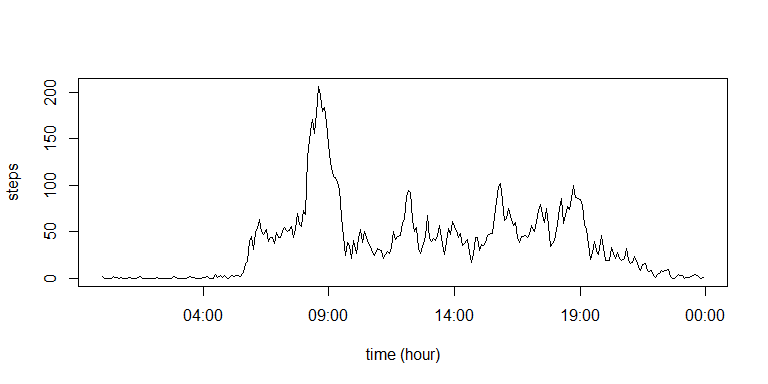
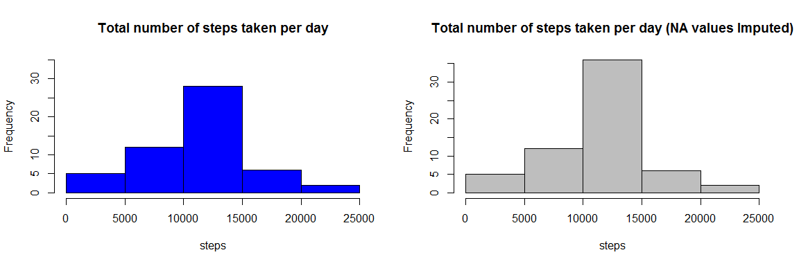
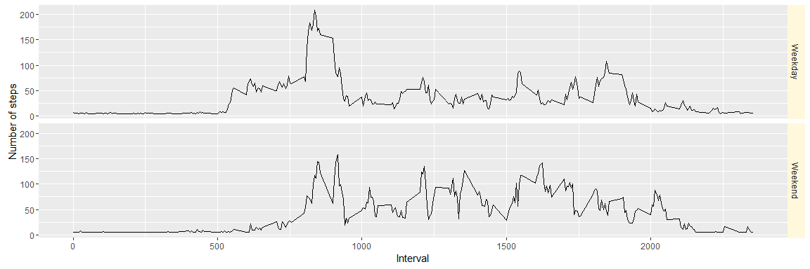

# Reproducible Research: Peer Assessment 1
MBX  
April 2016  


## Loading and preprocessing the data

Loading the data from the CSV file and preprocesing it in order to exclude the NA values


```r
  datos<-read.csv("activity.csv" , stringsAsFactors = TRUE , header = TRUE)
  Vcompl <- complete.cases(datos)
  datos_sin_na<- datos[Vcompl,]
```

## What is mean total number of steps taken per day?  

We use TAPPLY to calculate the total steps taken split by date. Then we can summarize the result vector

```r
  V_dayly_steps<-tapply(datos_sin_na$steps,datos_sin_na$date, sum  )
  summary (V_dayly_steps)
```

```
##    Min. 1st Qu.  Median    Mean 3rd Qu.    Max.    NA's 
##      41    8841   10760   10770   13290   21190       8
```


```r
  hist(V_dayly_steps , main = "Histogram of the total number of steps taken each day", col= "blue" , xlab = "steps" )
```




## What is the average daily activity pattern?

We add a new column "time" in order to transform the numeric interval to a time format. After that, we calculate the MEAN steps taken by interval across all days. 


```r
  datos_sin_na$time<- as.character(datos_sin_na$interval)
  datos_sin_na[datos_sin_na$interval < 10, ]$time <- paste("00:0", datos_sin_na[datos_sin_na$interval < 10, ]$interval , sep="" )
  datos_sin_na[datos_sin_na$interval >= 10 & datos_sin_na$interval < 100, ]$time <- paste("00:", datos_sin_na[datos_sin_na$interval >= 10 & datos_sin_na$interval < 100, ]$interval , sep="" )
  datos_sin_na[datos_sin_na$interval >= 100 & datos_sin_na$interval < 1000, ]$time <- paste("0", substr(datos_sin_na[datos_sin_na$interval >= 100 & datos_sin_na$interval < 1000 , ]$interval,1,1),":", substr(datos_sin_na[datos_sin_na$interval >= 100 & datos_sin_na$interval < 1000, ]$interval,2,3), sep="") 
  datos_sin_na[datos_sin_na$interval >= 1000 , ]$time <- paste( substr(datos_sin_na[datos_sin_na$interval >= 1000 , ]$interval,1,2),":", substr(datos_sin_na[datos_sin_na$interval >= 1000 , ]$interval,3,4), sep="") 

  datos_intv <- aggregate(datos_sin_na$steps, by=list( datos_sin_na$time), FUN= mean)
  datos_intv$time <-strptime(datos_intv$Group.1 , format = "%H:%M")
  names(datos_intv) <- c("Hour","steps","time")
  summary(datos_intv$steps)
```

```
##    Min. 1st Qu.  Median    Mean 3rd Qu.    Max. 
##   0.000   2.486  34.110  37.380  52.830 206.200
```
  
With this we can answer the question:

**Which 5-minute interval, on average across all the days in the dataset, contains the maximum number of steps?**


```r
  datos_intv[max(datos_intv$steps)==datos_intv$steps,]$Hour
```

```
## [1] "08:35"
```

**Time series plot of the 5-minute interval (x-axis) and the average number of steps taken, averaged across all days (y-axis)**


```r
  plot(datos_intv$time,datos_intv$steps , type="l", main="", ylab="steps", xlab="time (hour)" )
```



## Imputing missing values

To Impute the missing values, first we calculate how many are there in the dataset: 


```r
  sum(is.na(datos$steps))
```

```
## [1] 2304
```

Afterward, we assign the mean of the Non NA values to the missing ones. Here we use the TAPPLY function to calculate the total steps taken split by date. 


```r
  datos_imputed<-datos

  datos_imputed[is.na(datos_imputed$steps), "steps"] <- mean(na.omit(datos$steps))
                                                             
  V_dayly_steps_imputed<-tapply(datos_imputed$steps,datos_imputed$date, sum  )
  
  summary(V_dayly_steps_imputed)
```

```
##    Min. 1st Qu.  Median    Mean 3rd Qu.    Max. 
##      41    9819   10770   10770   12810   21190
```

Comparing with the previous results, we can see that there is indeed a change. There are more days with
total steps closer to the Mean.


```r
  par(mfrow=c(1,2))

  hist(V_dayly_steps , main = "Total number of steps taken per day", col= "blue" , xlab = "steps" , ylim =c(0,35))
  hist(V_dayly_steps_imputed , main = "Total number of steps taken per day (NA values Imputed)", col= "gray" , xlab = "steps" )
```




## Are there differences in activity patterns between weekdays and weekends?

To answer this question, we start by classifying the dates in "Weekdays" or "Weekends" depending on the results
of the function WEEKDAYS. With this classification, we can calculate the MEAN steps taken by Interval AND Day of the week, whether Weekend or Weekday.


```r
  datos_imp_new<-transform(datos_imputed, date = as.character(date))
  datos_imp_new$dayofweek <- weekdays(strptime(datos_imp_new$date, format="%Y-%m-%d"))
  datos_imp_new$dayofweek <- replace(datos_imp_new$dayofweek, datos_imp_new$dayofweek %in% c("Saturday","Sunday"), "Weekend" )
  datos_imp_new$dayofweek <- replace(datos_imp_new$dayofweek, !(datos_imp_new$dayofweek %in% c("Weekend")), "Weekday" )
  datos_imp_new$dayofweek <- as.factor(datos_imp_new$dayofweek)

  datos_int_imp <- aggregate(datos_imp_new$steps, by=list( datos_imp_new$interval, datos_imp_new$dayofweek), FUN= mean)
  names(datos_int_imp)<-c("Interval","Dayofweek","steps")
```

AS a result, we can see that there are differences in the activity patterns between Weekends and Weekdays, with a pronounced peak of activity in the Weekday mornings, and a more stable pattern of activity throghout the Weekend.


```r
  library(ggplot2)
  p<-ggplot(datos_int_imp, aes(Interval, steps)) +
    geom_line() +
    coord_cartesian() +
    scale_color_gradient() +
    theme(strip.background = element_rect(fill = "cornsilk", color = "cornsilk", size = 2)) +
    ylab("Number of steps") +
    facet_grid( Dayofweek ~ .)
    
  print(p)
```




